# DuShengCDN 商业版

DuShengCDN 是一个面向自有边缘节点的 CDN 管理平台，用于把多台自有服务器统一组织成可视化 CDN 网络。项目提供中心管理端、边缘 Agent、可选自建权威 DNS Worker，以及配套的二进制安装脚本，帮助用户完成站点代理、缓存分发、HTTPS 证书、节点管理、配置发布、访问日志、GSLB 调度和安全治理。

它适合以下场景：

- 想用自己的服务器搭建 CDN，而不是完全依赖第三方 CDN。
- 需要统一管理多个边缘节点的域名、源站、缓存、证书和发布配置。
- 需要自建权威 DNS，并按地区、ASN、运营商、节点健康状态做智能解析。
- 需要通过 Web 面板完成大多数运维操作，降低手工维护 Nginx/OpenResty 配置的复杂度。

商业正式版发布页：

https://github.com/SatanDS/SatanDS-DuShengCDN-releases/releases

DuShengCDN 主要由三个核心组件组成：

| 组件 | 说明 |
| --- | --- |
| Server | 中心控制面板与 API 服务，负责用户、站点、源站、证书、DNS、节点、发布版本、授权、日志和运行状态管理。 |
| Agent | 部署在边缘节点上，负责接收 Server 下发的配置，管理 OpenResty 配置、证书、Lua 资源、缓存索引、心跳和观测数据。 |
| DNS Worker | 可选组件，用于自建权威 DNS，监听 UDP/TCP 53 端口，从 Server 拉取 DNS 快照并返回解析结果。 |

## 功能特性
## 1. 功能特性
##   DuShengCDN Server 提供 Web 管理面板，用于统一管理 CDN 资源：
- **可视化 CDN 管理**：
  - 源站管理
  - 边缘节点管理
  - 证书管理
  - DNS Zone 管理
  - 配置版本发布
  - 节点状态查看
  - 访问日志查看
  - 商业授权管理
  - 系统运行状态查看

- **站点与源站代理**：
  - 多域名站点管理
  - HTTP / HTTPS 代理
  - 源站地址配置
  - Host 透传或自定义
  - 站点启停
  - 配置版本化发布
  - 节点按需同步最新配置

- **缓存与边缘分发**：
  - OpenResty 配置生成
  - 路由配置下发
  - 证书文件同步
  - Lua 运行资源同步
  - 缓存索引维护
  - 缓存清理接口支撑
  - 访问日志采集
  - 观测数据缓冲与回传
  - 针对类Emby/Jellyfin/Plex影视服务缓存进行优化

- **HTTPS 与证书管理**：
  - 在面板中添加域名。
  - 配置证书或申请证书。
  - 将证书绑定到站点。
  - 发布配置到边缘节点。
  - Agent 同步证书和 OpenResty 配置。
  - 用户通过 HTTPS 访问边缘节点。
  - 集成 ACME 相关能力支持8层链路（目前只支持自建权威DNS下的跨域链路，暂不支持DNS递归）

- **边缘节点Agent**：
  - 节点名称
  - 节点
  - IP
  - Agent 版本
  - OpenResty 版本
  - 心跳状态
  - 配置应用结果
  - 访问与观测数据
  - 本地缓存状态
  - 每30s上报所在边缘节点对CN三大运营商的延迟情况给Server进行调度
    
- **访问日志与观测数据**：
  - 原始访问日志
  - 按时间折叠后的访问数据
  - IP 访问汇总
  - IP 趋势
  - 节点维度统计
  - Host / Path 维度过滤
  - 日志清理与保留策略

- **自建权威 DNS 与 GSLB调度**：
  - 来源 IP
  - ASN
  - 运营商 CIDR
  - 区域索引
  - 权重
  - 快照过期保护
  - 查询限速
  - UDP 响应大小控制
  - GeoIP 国家/地区（省/市，支持自上传商用库调度可精确到区）
  - 节点健康状态（边缘节点的负载情况）
  - 网络波动感知（网络波动感知会根据来源运营商叠加三网 TCP 延迟波动状态，异常路径优先降权或屏蔽恢复后自动调整为原权重。）
  - 检测到DDOS攻击自动解析致自定义清洗边缘节点
```text
用户 DNS 查询
   │
   ▼
DNS Worker
   │
   ├── 判断用户来源地区/ 网段 / ASN / 运营商 / 当前用户运营商对边缘节点是否健康
   ├── 读取 Server 下发的 DNS 快照
   ├── 选择合适边缘节点
   ▼
返回边缘节点 IP
```
- **DNSSEC 支持**：
  - 如果启用 DNSSEC，需要在 Server 和 DNS Worker 使用相同的 DNSSEC 私钥加密密钥。
示例：
"
openssl rand -base64 48
"
然后把生成的值配置到：DUSHENGCDN_DNSSEC_KEY_ENCRYPTION_KEY,启用 DNSSEC 后，建议先在面板导出 DS 记录，再到域名注册商处添加 DS 记录。
关闭 DNSSEC 时，建议先删除注册商处的 DS 记录，等待缓存过期后再关闭面板中的 DNSSEC，避免解析验证失败。

## 界面预览

### 主面板
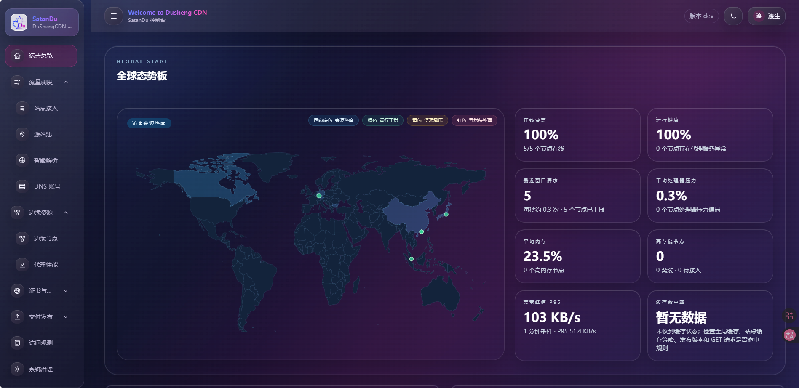

### 负载均衡概览
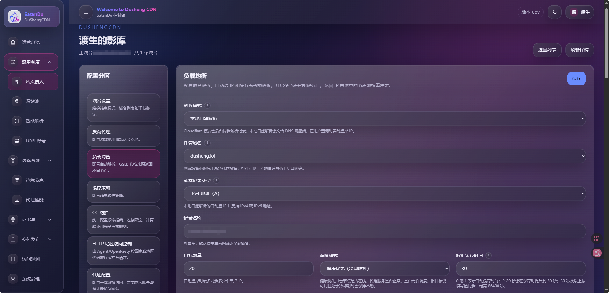
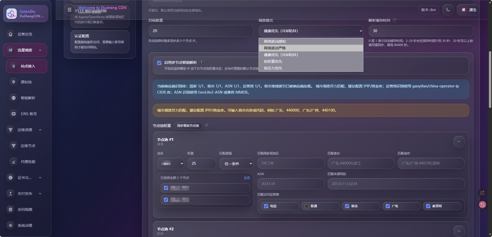
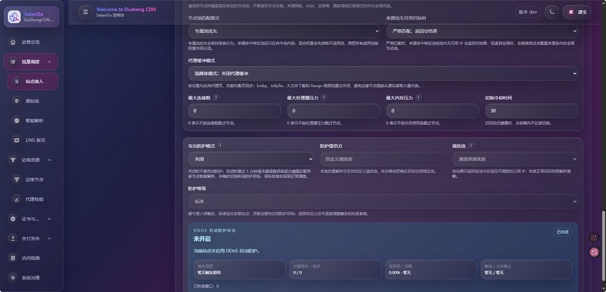

### 缓存策略
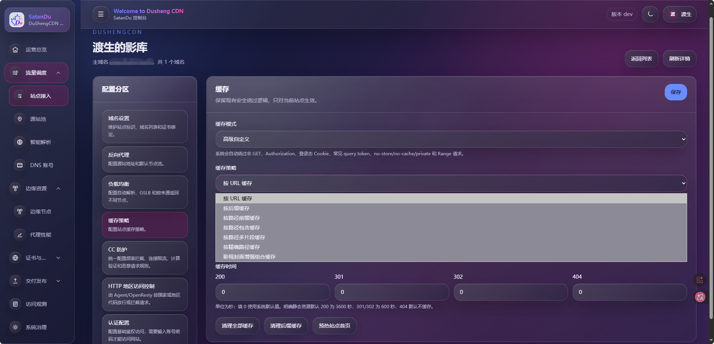

### 自建权威DNS
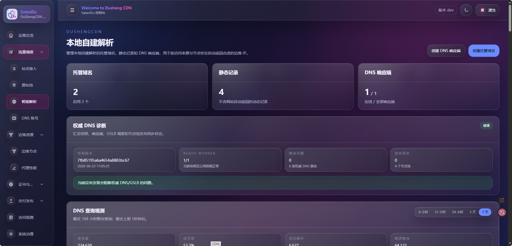
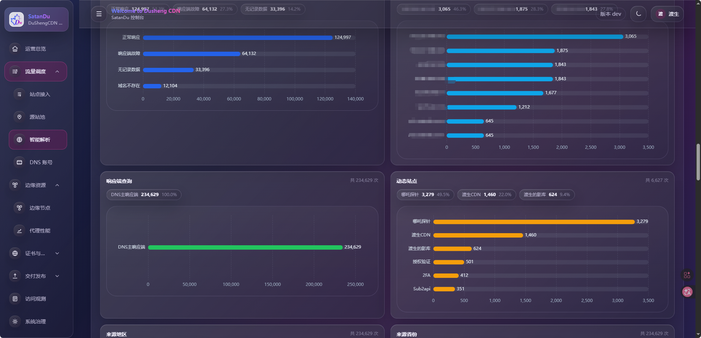
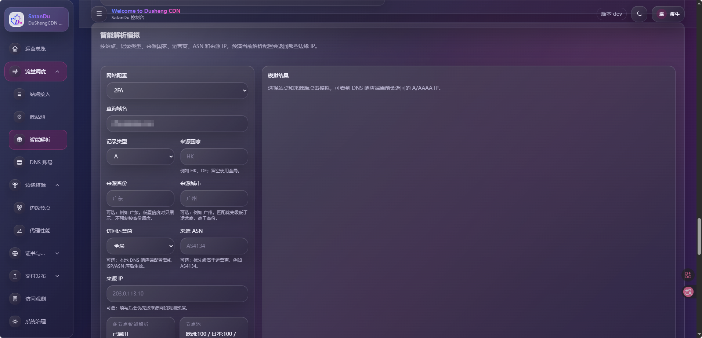

### CC防御
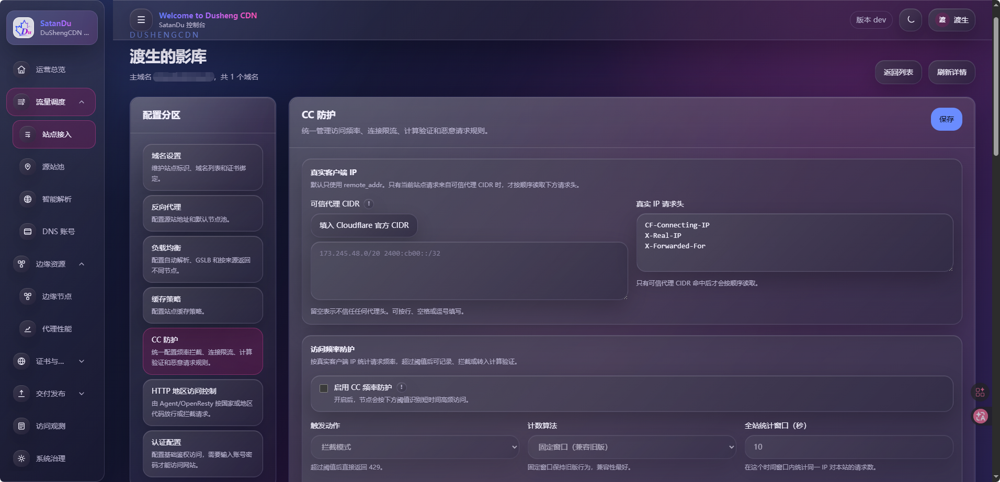
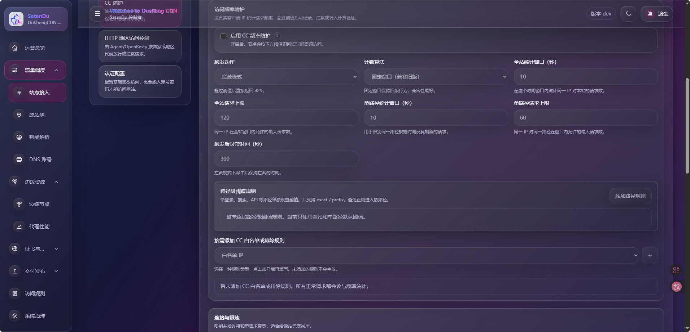
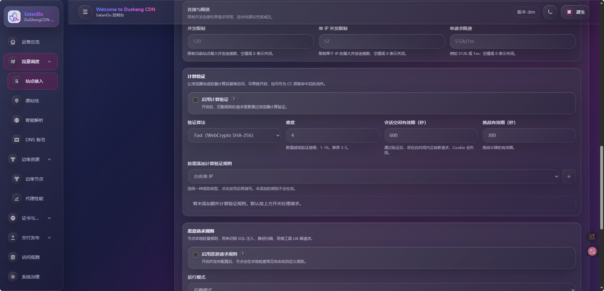
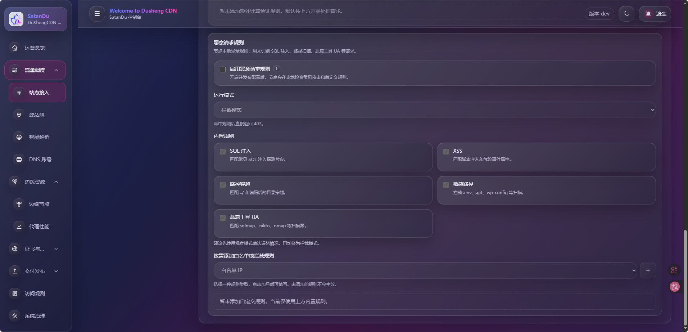

## 发布资产说明

在 GitHub Releases 中，每个主资产都应同时存在同名 `.sha256` 和 `.sig` 文件。请始终从官方 release 页下载安装脚本和程序文件，不要混用不同版本的资产。

| 资产 | 用途 |
| --- | --- |
| `install-commercial.sh` | Linux Server 一键安装脚本 |
| `install-agent.sh` | Linux Agent 一键安装脚本 |
| `install-dns-worker.sh` | Linux DNS Worker 一键安装脚本 |
| `dushengcdn-server-linux-amd64` / `linux-arm64` | Linux Server 程序文件 |
| `dushengcdn-server-darwin-amd64` / `darwin-arm64` | macOS Server 程序文件 |
| `dushengcdn-server-windows-amd64.exe` | Windows Server 程序文件 |
| `dushengcdn-agent-linux-amd64` / `linux-arm64` | Linux Agent 程序文件 |
| `dushengcdn-agent-darwin-amd64` / `darwin-arm64` | macOS Agent 程序文件 |
| `dushengcdn-dns-worker-linux-amd64` / `linux-arm64` | Linux DNS Worker 程序文件 |
| `dushengcdn-dns-worker-darwin-amd64` / `darwin-arm64` | macOS DNS Worker 程序文件 |
| `dushengcdn-dns-worker-windows-amd64.exe` | Windows DNS Worker 程序文件 |
| `*.sha256` | 对应资产的 SHA-256 校验文件 |
| `*.sig` | 对应资产的 release 签名文件 |

Linux + systemd 环境推荐使用安装脚本。其它平台可以下载对应程序文件，并按自己的服务管理方式运行。

## 部署前准备

推荐环境：

- Linux x86_64 或 arm64，使用 systemd 管理服务。
- 一个公网可访问的面板域名，例如 `cdn.example.com`。
- 面板域名的 TLS 证书，以及 Nginx/OpenResty/宝塔等 HTTPS 反向代理。
- Agent 边缘节点建议独占 80/443 端口。
- DNS Worker 需要公网 UDP/TCP 53 可达，并在域名注册商处完成 NS 委派。

| 组件         | CPU | 内存      | 端口             |
| ---------- | --- | ------- | -------------- |
| Server     | 1 核 | 1 GB+   | 3010 或反代后的 443 |
| Agent      | 1 核 | 512 MB+ | 80、443         |
| DNS Worker | 1 核 | 512 MB+ | UDP 53、TCP 53  |


安装前请准备：

- 商业授权 token，或授权服务提供的激活信息。
- 管理面板域名。
- Agent 接入 token：在面板创建节点或开启发现注册后获得。
- DNS Worker token：在面板的本地自建解析页面创建响应端后获得。
## 快速开始
# DuShengCDN 公网直连部署教程

本文介绍 DuShengCDN Server 直接监听公网地址的部署方式。该方式不使用 `127.0.0.1:3010` 内网监听，也不依赖 Nginx / OpenResty / 宝塔反向代理，而是让 DuShengCDN Server 直接绑定公网网卡，对外提供 Web 面板和 API 服务。

## 一、部署方式说明

常规推荐部署方式通常是：

```text
公网用户
  ↓
Nginx / OpenResty HTTPS 反向代理
  ↓
127.0.0.1:3010
  ↓
DuShengCDN Server
```

本文采用的公网直连部署方式是：

```text
公网用户
  ↓
服务器公网 IP:3010
  ↓
DuShengCDN Server
```

也就是让 Server 直接监听：

```text
0.0.0.0:3010
```

部署完成后，可以通过下面的地址访问面板：

```text
http://服务器公网IP:3010
```

例如：

```text
http://1.2.3.4:3010
```

## 二、重要安全提醒

公网直连模式部署简单，但安全性弱于 HTTPS 反向代理模式。

需要注意：

1. 面板会直接暴露到公网。
2. 如果没有额外配置 TLS，访问地址通常是 HTTP 明文。
3. 必须设置强密码。
4. 必须配置服务器防火墙或云厂商安全组。
5. 不建议把面板暴露给全网所有 IP。
6. 推荐只允许自己的办公 IP、家宽 IP、跳板机 IP 访问 `3010` 端口。

如果是生产环境，更推荐后续升级为 HTTPS 反向代理模式。

---

## 三、服务器准备

### 1. 系统要求

推荐使用：

```text
Ubuntu 22.04 / Ubuntu 24.04
Debian 12
Rocky Linux 9
AlmaLinux 9
```

最低配置建议：

```text
CPU：1 核以上
内存：1 GB 以上
磁盘：10 GB 以上
公网 IP：需要
```

### 2. 需要开放的端口

Server 公网直连部署至少需要开放：

| 端口   | 协议  | 说明                            |
| ---- | --- | ----------------------------- |
| 3010 | TCP | DuShengCDN Server Web 面板和 API |

如果后续还要在同一台机器部署 Agent，不建议和 Server 混在一起。Agent 通常需要占用：

| 端口  | 协议  | 说明         |
| --- | --- | ---------- |
| 80  | TCP | HTTP 边缘访问  |
| 443 | TCP | HTTPS 边缘访问 |

如果后续部署 DNS Worker，还需要开放：

| 端口 | 协议  | 说明     |
| -- | --- | ------ |
| 53 | UDP | DNS 查询 |
| 53 | TCP | DNS 查询 |

---

## 四、安装基础依赖
Ubuntu / Debian 执行：

```bash
sudo apt update
sudo apt install -y curl ca-certificates openssl
```

Rocky Linux / AlmaLinux / CentOS 执行：

```bash
sudo dnf install -y curl ca-certificates openssl
```

如果是旧版 CentOS：

```bash
sudo yum install -y curl ca-certificates openssl
```

---

## 五、安装 DuShengCDN Server

### 1. 使用公网直连方式安装

执行下面命令：

```bash
curl -fsSL https://github.com/SatanDS/SatanDS-DuShengCDN-releases/releases/latest/download/install-commercial.sh | bash -s -- \
  --install-dir /opt/dushengcdn \
  --service-name dushengcdn \
  --http-port 3010 \
  --listen-address 0.0.0.0
```
### 2. 参数说明

| 参数                              | 说明            |
| ------------------------------- | ------------- |
| `--install-dir /opt/dushengcdn` | 安装目录          |
| `--service-name dushengcdn`     | systemd 服务名   |
| `--http-port 3010`              | 面板监听端口        |
| `--listen-address 0.0.0.0`      | 监听所有网卡，允许公网访问 |

安装完成后，程序会创建 systemd 服务：
```text
dushengcdn
```
并生成配置文件：

```text
/opt/dushengcdn/dushengcdn.env
```
数据目录为：

```text
/opt/dushengcdn/data
```

---

## 六、开放公网端口

### 方式一：Ubuntu UFW 防火墙

如果服务器启用了 UFW：

```bash
sudo ufw allow 3010/tcp
sudo ufw reload
sudo ufw status
```

如果只想允许指定 IP 访问，例如只允许 `8.8.8.8` 访问面板：

```bash
sudo ufw allow from 8.8.8.8 to any port 3010 proto tcp
sudo ufw reload
```

不建议长期使用：

```bash
sudo ufw allow 3010/tcp
```

因为这会让所有公网 IP 都能访问面板。

---

### 方式二：firewalld 防火墙

Rocky Linux / AlmaLinux 常用 firewalld。

开放 3010：

```bash
sudo firewall-cmd --permanent --add-port=3010/tcp
sudo firewall-cmd --reload
sudo firewall-cmd --list-ports
```

如果只允许指定 IP 访问，建议使用云厂商安全组实现，配置更直观。

---

### 方式三：云服务器安全组

如果你使用的是腾讯云、阿里云、华为云、AWS、Vultr、DigitalOcean 等云服务器，还需要在云厂商控制台开放安全组。

添加入站规则：

```text
协议：TCP
端口：3010
来源：你的公网 IP/32
```

例如：

```text
8.8.8.8/32
```

如果只是临时测试，也可以开放：

```text
0.0.0.0/0
```

但生产环境不建议这样做。

---

## 七、启动与检查服务

### 1. 查看服务状态

```bash
sudo systemctl status dushengcdn --no-pager
```

正常情况下应该看到：

```text
active (running)
```

### 2. 查看运行日志

```bash
sudo journalctl -u dushengcdn -f
```

### 3. 检查监听端口

```bash
ss -lntp | grep 3010
```

正常情况下可以看到类似：

```text
LISTEN 0 4096 0.0.0.0:3010
```

重点是：

```text
0.0.0.0:3010
```

如果看到：

```text
127.0.0.1:3010
```

说明仍然只监听本机，没有真正面向公网。

---

## 八、访问面板

在浏览器访问：

```text
http://服务器公网IP:3010
```

例如：

```text
http://1.2.3.4:3010
```

如果你已经解析了域名，也可以访问：

```text
http://cdn.example.com:3010
```

注意，这种方式默认是 HTTP，不是 HTTPS。

---

## 九、查看初始管理员密码

默认管理员用户名：

```text
root
```

初始密码文件通常在：

```text
/opt/dushengcdn/data/initial-root-password.txt
```

查看密码：

```bash
sudo cat /opt/dushengcdn/data/initial-root-password.txt
```

内容一般类似：

```text
username=root
password=xxxxxxxxxxxxxxxxxxxxxxxxxxxxxxxx
```

登录面板后，请立即修改 root 密码。

---

## 十、修改配置文件

Server 配置文件位置：

```text
/opt/dushengcdn/dushengcdn.env
```

查看配置：

```bash
sudo cat /opt/dushengcdn/dushengcdn.env
```

编辑配置：

```bash
sudo nano /opt/dushengcdn/dushengcdn.env
```

公网直连模式下，关键配置应该类似：

```env
PORT=3010
DUSHENGCDN_LISTEN_ADDRESS=0.0.0.0
GIN_MODE=release
LOG_LEVEL=info
SQLITE_PATH=/opt/dushengcdn/data/dushengcdn.db
```

修改后重启：

```bash
sudo systemctl restart dushengcdn
```

---

## 十一、修改监听端口

如果你不想使用 `3010`，例如想改成 `8080`：

```bash
sudo nano /opt/dushengcdn/dushengcdn.env
```

修改：

```env
PORT=8080
DUSHENGCDN_LISTEN_ADDRESS=0.0.0.0
```

重启服务：

```bash
sudo systemctl restart dushengcdn
```

开放防火墙：

```bash
sudo ufw allow 8080/tcp
```

访问：

```text
http://服务器公网IP:8080
```

---

## 十三、安装商业授权

如果你有商业授权 token，推荐使用文件方式安装。

创建 token 授权文件：

```bash
sudo mkdir -p /run/secrets
sudo nano /run/secrets/dushengcdn-license-token
sudo chmod 600 /run/secrets/dushengcdn-license-token
```

重新执行安装脚本并带上授权文件：

```bash
curl -fsSL https://github.com/SatanDS/SatanDS-DuShengCDN-releases/releases/latest/download/install-commercial.sh | bash -s -- \
  --install-dir /opt/dushengcdn \
  --service-name dushengcdn \
  --http-port 3010 \
  --listen-address 0.0.0.0 \
  --license-token-file /run/secrets/dushengcdn-license-token
```

也可以登录面板后，在：

```text
系统治理 -> 商业授权
```

手动安装授权。

---

## 十四、部署 Agent 时填写公网 Server 地址

Server 公网直连后，Agent 的 `--server-url` 应该填写公网地址。

例如 Server 地址是：

```text
http://1.2.3.4:3010
```

那么 Agent 安装命令应为：

```bash
curl -fsSL https://github.com/SatanDS/SatanDS-DuShengCDN-releases/releases/latest/download/install-agent.sh | bash -s -- \
  --server-url http://1.2.3.4:3010 \
  --agent-token-file /run/secrets/dushengcdn-agent-token
```

如果使用域名：

```bash
curl -fsSL https://github.com/SatanDS/SatanDS-DuShengCDN-releases/releases/latest/download/install-agent.sh | bash -s -- \
  --server-url http://cdn.example.com:3010 \
  --agent-token-file /run/secrets/dushengcdn-agent-token
```

注意：这里使用的是 `http://`，不是 `https://`。

因为公网直连模式没有经过 HTTPS 反向代理。

---

## 十五、部署 DNS Worker 时填写公网 Server 地址

DNS Worker 同样需要连接 Server。

示例：

```bash
curl -fsSL https://github.com/SatanDS/SatanDS-DuShengCDN-releases/releases/latest/download/install-dns-worker.sh | bash -s -- \
  --server-url http://1.2.3.4:3010 \
  --token-file /run/secrets/dushengcdn-dns-worker-token \
  --listen 0.0.0.0:53
```

或者：

```bash
curl -fsSL https://github.com/SatanDS/SatanDS-DuShengCDN-releases/releases/latest/download/install-dns-worker.sh | bash -s -- \
  --server-url http://cdn.example.com:3010 \
  --token-file /run/secrets/dushengcdn-dns-worker-token \
  --listen 0.0.0.0:53
```

---

## 十六、升级 Server

公网直连模式升级时，继续带上：

```bash
--listen-address 0.0.0.0
```

示例：

```bash
curl -fsSL https://github.com/SatanDS/SatanDS-DuShengCDN-releases/releases/latest/download/install-commercial.sh | bash -s -- \
  --install-dir /opt/dushengcdn \
  --service-name dushengcdn \
  --http-port 3010 \
  --listen-address 0.0.0.0
```

升级后检查：

```bash
sudo systemctl status dushengcdn --no-pager
sudo journalctl -u dushengcdn -n 100 --no-pager
```

---

## 十七、常见问题

### 1. 浏览器访问不了面板

先检查服务是否运行：

```bash
sudo systemctl status dushengcdn --no-pager
```

再检查监听地址：

```bash
ss -lntp | grep 3010
```

如果看到：

```text
127.0.0.1:3010
```

说明没有监听公网，需要修改：

```env
DUSHENGCDN_LISTEN_ADDRESS=0.0.0.0
```

然后重启：

```bash
sudo systemctl restart dushengcdn
```

---

### 2. 服务正常，但公网访问不了

检查服务器防火墙：

```bash
sudo ufw status
```

或者：

```bash
sudo firewall-cmd --list-ports
```

还要检查云厂商安全组是否开放 `3010/tcp`。

---

### 3. 登录后提示不安全

公网直连模式默认是 HTTP，浏览器可能提示不安全。

这是正常现象。

如果需要 HTTPS，推荐改成反向代理部署：

```text
公网 HTTPS -> Nginx / OpenResty -> 127.0.0.1:3010
```

---

### 4. Agent 连接不上 Server

检查 Agent 安装时的 `--server-url` 是否填写公网地址。

公网直连模式示例：

```text
http://1.2.3.4:3010
```

不要写成：

```text
http://127.0.0.1:3010
```

因为 Agent 在另一台服务器上访问 `127.0.0.1` 时，访问的是 Agent 自己，不是 Server。

---

### 5. 是否可以直接绑定 443

不建议。

Server 本身直接监听时通常是 HTTP 服务。即使你把端口改成 `443`，也不等于自动变成 HTTPS。

如果需要 HTTPS，请使用 Nginx / OpenResty / Caddy 反向代理。

---

## 十八、推荐的公网直连最小部署命令

如果只是快速部署，直接使用：

```bash
sudo apt update
sudo apt install -y curl ca-certificates openssl

curl -fsSL https://github.com/SatanDS/SatanDS-DuShengCDN-releases/releases/latest/download/install-commercial.sh | bash -s -- \
  --install-dir /opt/dushengcdn \
  --service-name dushengcdn \
  --http-port 3010 \
  --listen-address 0.0.0.0

sudo ufw allow 3010/tcp
sudo systemctl status dushengcdn --no-pager
```

访问：

```text
http://服务器公网IP:3010
```

查看初始密码：

```bash
sudo cat /opt/dushengcdn/data/initial-root-password.txt
```

---

## 十九、生产环境建议

公网直连可以用于快速测试、临时部署或内测环境。

正式生产环境更建议：

1. Server 监听 `127.0.0.1:3010`。
2. 使用 Nginx / OpenResty / Caddy 提供 HTTPS。
3. 面板域名使用 TLS 证书。
4. 只开放 80 / 443。
5. 关闭公网 3010。
6. 配置防火墙限制管理面板访问来源。
7. 定期备份 `/opt/dushengcdn/data` 和 `/opt/dushengcdn/dushengcdn.env`。

公网直连部署虽然简单，但面板直接暴露在公网，长期运行时需要特别注意安全。


# DuShengCDN Server 监听 `127.0.0.1:3010` 部署教程

本文介绍 DuShengCDN 使用 **Server 仅监听本机回环地址 **`` 的部署方式。

这是推荐的生产部署模式。

适合：

* 公网生产环境
* 使用 Nginx / OpenResty / Caddy 反向代理
* 使用 HTTPS 域名访问管理面板
* 不希望 Server API 直接暴露到公网
* 需要统一 TLS、WAF、安全策略的场景

在这种模式下：

* DuShengCDN Server 仅监听本机 `127.0.0.1:3010`
* 外部用户无法直接访问 3010
* 管理员通过反向代理访问面板
* Agent 和 DNS Worker 通过公网域名或 HTTPS 地址连接 Server

---

## 一、部署架构

推荐架构如下：

```text
管理员浏览器
      ↓
https://cdn.example.com
      ↓
Nginx / OpenResty / Caddy
      ↓
127.0.0.1:3010
      ↓
DuShengCDN Server
```

Agent 和 DNS Worker：

```text
Agent
   ↓
https://cdn.example.com
   ↓
反向代理
   ↓
127.0.0.1:3010

DNS Worker
   ↓
https://cdn.example.com
   ↓
反向代理
   ↓
127.0.0.1:3010
```

---

## 二、和公网直连部署的区别

公网直连部署通常使用：

```text
--listen-address 0.0.0.0
```

表示监听所有网卡。

任何能够访问服务器的人都可以直接访问：

```text
http://服务器IP:3010
```

而推荐部署方式使用：

```text
--listen-address 127.0.0.1
```

表示：

```text
仅本机访问
```

外部无法直接连接：

```text
http://服务器IP:3010
```

必须经过反向代理。

---

## 三、部署前准备

### 1. 域名准备

假设管理面板域名：

```text
cdn.example.com
```

解析到 Server 所在服务器。

例如：

```text
cdn.example.com -> 1.2.3.4
```

---

### 2. 开放公网端口

开放：

| 端口  | 协议  | 用途    |
| --- | --- | ----- |
| 80  | TCP | HTTP  |
| 443 | TCP | HTTPS |

不需要开放：

| 端口   | 协议  |
| ---- | --- |
| 3010 | TCP |

因为 3010 只允许本机访问。

---

### 3. 安装基础依赖

Ubuntu / Debian：

```bash
sudo apt update
sudo apt install -y curl ca-certificates openssl
```

Rocky Linux / AlmaLinux：

```bash
sudo dnf install -y curl ca-certificates openssl
```

---

## 四、安装 Server

### 1. 使用本机监听方式安装

执行：

```bash
curl -fsSL https://github.com/SatanDS/SatanDS-DuShengCDN-releases/releases/latest/download/install-commercial.sh | bash -s -- \
  --install-dir /opt/dushengcdn \
  --service-name dushengcdn \
  --http-port 3010 \
  --listen-address 127.0.0.1
```

关键参数：

```bash
--listen-address 127.0.0.1
```

表示：

```text
仅本机访问
```

---

### 2. 检查监听状态

执行：

```bash
ss -lntp | grep 3010
```

正确结果类似：

```text
LISTEN 0 4096 127.0.0.1:3010
```

这是正常状态。

如果看到：

```text
0.0.0.0:3010
```

说明已经暴露公网。

如果看到：

```text
公网IP:3010
```

说明配置错误。

---

## 五、查看初始管理员密码

默认管理员：

```text
root
```

查看密码：

```bash
sudo cat /opt/dushengcdn/data/initial-root-password.txt
```

登录后请立即修改密码。

---

## 六、安装 Nginx

Ubuntu：

```bash
sudo apt install -y nginx
```

Rocky Linux：

```bash
sudo dnf install -y nginx
```

启动：

```bash
sudo systemctl enable nginx
sudo systemctl start nginx
```

检查：

```bash
sudo systemctl status nginx
```

---

## 七、配置反向代理

创建配置：

```bash
sudo nano /etc/nginx/conf.d/dushengcdn.conf
```

内容：

```nginx
server {
    listen 80;
    server_name cdn.example.com;

    location / {
        proxy_pass http://127.0.0.1:3010;

        proxy_http_version 1.1;

        proxy_set_header Host $host;
        proxy_set_header X-Forwarded-Proto $scheme;
        proxy_set_header X-Forwarded-For $proxy_add_x_forwarded_for;
        proxy_set_header X-Real-IP $remote_addr;

        proxy_set_header Upgrade $http_upgrade;
        proxy_set_header Connection "upgrade";
    }
}
```

检查配置：

```bash
sudo nginx -t
```

重载：

```bash
sudo systemctl reload nginx
```

---

## 八、配置 HTTPS

推荐使用 Let's Encrypt。

安装 Certbot：

```bash
sudo apt install -y certbot python3-certbot-nginx
```

申请证书：

```bash
sudo certbot --nginx -d cdn.example.com
```

完成后访问：

```text
https://cdn.example.com
```

即可进入 DuShengCDN 面板。

---

## 九、防火墙配置

### UFW

允许：

```bash
sudo ufw allow 80/tcp
sudo ufw allow 443/tcp
```

不要开放：

```bash
sudo ufw allow 3010/tcp
```

如果已经开放：

```bash
sudo ufw delete allow 3010/tcp
```

查看：

```bash
sudo ufw status
```

---

### firewalld

允许：

```bash
sudo firewall-cmd --permanent --add-service=http
sudo firewall-cmd --permanent --add-service=https
sudo firewall-cmd --reload
```

不要开放：

```text
3010/tcp
```

---

## 十、Agent 部署

Agent 不应该连接：

```text
http://127.0.0.1:3010
```

因为 Agent 不在 Server 本机。

应该连接反向代理地址：

```text
https://cdn.example.com
```

安装：

```bash
curl -fsSL https://github.com/SatanDS/SatanDS-DuShengCDN-releases/releases/latest/download/install-agent.sh | bash -s -- \
  --server-url https://cdn.example.com \
  --agent-token-file /run/secrets/dushengcdn-agent-token
```

---

## 十一、DNS Worker 部署

DNS Worker 同样连接反向代理地址：

```bash
curl -fsSL https://github.com/SatanDS/SatanDS-DuShengCDN-releases/releases/latest/download/install-dns-worker.sh | bash -s -- \
  --server-url https://cdn.example.com \
  --token-file /run/secrets/dushengcdn-dns-worker-token \
  --listen 0.0.0.0:53
```

---

## 十二、访问管理面板

访问：

```text
https://cdn.example.com
```

而不是：

```text
http://服务器IP:3010
```

因为：

```text
127.0.0.1:3010
```

只能本机访问。

---

## 十三、常用检查命令

### Server

```bash
sudo systemctl status dushengcdn --no-pager
sudo journalctl -u dushengcdn -f
ss -lntp | grep 3010
```

正确结果：

```text
127.0.0.1:3010
```

---

### Nginx

```bash
sudo systemctl status nginx
sudo nginx -t
```

---

### Agent

```bash
sudo systemctl status dushengcdn-agent --no-pager
sudo journalctl -u dushengcdn-agent -f
```

---

### DNS Worker

```bash
sudo systemctl status dushengcdn-dns-worker --no-pager
sudo journalctl -u dushengcdn-dns-worker -f
```

---

## 十四、升级 Server

升级时继续保持：

```bash
--listen-address 127.0.0.1
```

例如：

```bash
curl -fsSL https://github.com/SatanDS/SatanDS-DuShengCDN-releases/releases/latest/download/install-commercial.sh | bash -s -- \
  --install-dir /opt/dushengcdn \
  --service-name dushengcdn \
  --http-port 3010 \
  --listen-address 127.0.0.1
```

升级后检查：

```bash
ss -lntp | grep 3010
```

确认仍然显示：

```text
127.0.0.1:3010
```

而不是：

```text
0.0.0.0:3010
```

---

## 十五、常见问题

### 1. 浏览器访问不了面板

检查：

```bash
sudo systemctl status dushengcdn
```

确认：

```bash
ss -lntp | grep 3010
```

显示：

```text
127.0.0.1:3010
```

然后检查 Nginx：

```bash
sudo nginx -t
```

---

### 2. Agent 无法连接 Server

检查 Agent 配置中的：

```text
--server-url
```

是否填写：

```text
https://cdn.example.com
```

不要填写：

```text
http://127.0.0.1:3010
```

---

### 3. 为什么不能开放 3010

因为：

```text
127.0.0.1:3010
```

本身就是为了避免管理面板直接暴露公网。

推荐：

```text
公网用户
    ↓
HTTPS
    ↓
Nginx
    ↓
127.0.0.1:3010
```

而不是：

```text
公网用户
    ↓
3010
    ↓
DuShengCDN Server
```

---

### 4. 是否可以不用 Nginx

可以。

也可以使用：

* OpenResty
* Caddy
* Traefik
* HAProxy

只要能够反向代理到：

```text
127.0.0.1:3010
```

即可。

---

## 十六、推荐生产部署命令

```bash
curl -fsSL https://github.com/SatanDS/SatanDS-DuShengCDN-releases/releases/latest/download/install-commercial.sh | bash -s -- \
  --install-dir /opt/dushengcdn \
  --service-name dushengcdn \
  --http-port 3010 \
  --listen-address 127.0.0.1
```

检查：

```bash
ss -lntp | grep 3010
```

结果：

```text
127.0.0.1:3010
```

然后配置：

```text
Nginx / OpenResty / Caddy
```

反向代理到：

```text
127.0.0.1:3010
```

最终通过：

```text
https://cdn.example.com
```

访问管理面板。

---

## 十七、安全建议

1. Server 始终监听 `127.0.0.1`。
2. 不开放公网 `3010`。
3. 使用 HTTPS 域名访问面板。
4. Agent 和 DNS Worker 使用 HTTPS 地址连接 Server。
5. 配置可信代理 IP。
6. 登录后立即修改 root 密码。
7. 定期备份 `/opt/dushengcdn/data`。
8. 定期检查监听状态：

```bash
ss -lntp | grep 3010
```

正确结果应始终为：

```text
127.0.0.1:3010
```

这是 DuShengCDN 适合生产环境的部署方式。


## 创建第一个站点

推荐顺序：

1. 登录面板，确认商业授权状态正常。
2. 在「节点和IP池」确认至少一个 Agent 在线。
3. 添加源站，填写业务源站地址。
4. 创建网站或代理路由，绑定域名、源站和节点池。
5. 上传或申请 TLS 证书。
6. 保存配置后，进入预览或发布版本页面检查变更。
7. 发布并激活新版本，等待 Agent 应用成功。
8. 将业务域名解析到边缘节点，或切换到本地自建解析。
9. 用浏览器和 `curl -I https://your-domain` 验证访问结果。

如果使用 DNS Worker，请额外确认：

- 注册商 NS 已委派到 DNS Worker 所在服务器。
- UDP/TCP 53 都能从公网访问。
- 面板中的 DNS 快照版本与 Worker 心跳版本一致。
- 多个响应端的快照版本一致，避免不同 NS 返回不一致结果。

## 回滚

1. 保留上一版本的程序文件、`.sha256` 和 `.sig`。
2. 回滚前备份 Server 数据库、配置文件、证书、上传目录、Agent 数据和 DNS Worker 快照。
3. Server 可通过面板上传三件套，或重跑官方安装脚本并指定上一版本。
4. Agent 和 DNS Worker 优先重跑带签名校验的官方安装脚本。
5. 回滚后检查授权状态、节点在线状态、DNS 快照、配置版本和应用记录。

## 授权说明

商业 Server 需要有效授权才能启用商业能力。授权通常通过商业授权 token 安装，并连接授权服务完成在线激活。

需要注意：

- Server 所在机器需要能访问安装时配置的 `--activation-url`。
- 系统时间应保持准确，建议启用 NTP。
- 授权会绑定机器指纹；换机、迁移或重装后可能需要走 rehost 或重新激活流程。
- 授权到期、租约续期失败、授权被吊销或机器绑定不匹配时，商业能力可能被限制。
- 客户包只包含程序、安装脚本、校验文件和验签所需公钥。

## 安全与备份建议

- 始终从 `SatanDS/SatanDS-DuShengCDN-releases` 下载资产。
- 不要混用不同版本的程序文件、`.sha256` 和 `.sig`。
- 面板建议只通过 HTTPS 暴露，Server 后端端口绑定本机或内网。
- `TRUSTED_PROXIES` 只填写受控反向代理 IP/CIDR。
- Agent 节点建议独占 80/443，不要和其它 Web 服务混用同一套 OpenResty 配置目录。
- DNS Worker 生产环境至少部署两个公网响应端，并同时放行 UDP/TCP 53。
- 定期备份 Server 数据库、`/opt/dushengcdn/dushengcdn.env`、上传目录、证书、Agent 数据目录、DNS Worker 配置和快照。
- 备份文件请加密保存，并限制访问权限。

## 常见排查

Server 无法访问：

```bash
systemctl status dushengcdn --no-pager
journalctl -u dushengcdn -n 200 --no-pager
curl -I http://127.0.0.1:3010/api/status
```

Agent 不在线：

```bash
systemctl status dushengcdn-agent --no-pager
journalctl -u dushengcdn-agent -n 200 --no-pager
curl -I https://cdn.example.com/api/status
```

DNS Worker 无响应：

```bash
systemctl status dushengcdn-dns-worker --no-pager
journalctl -u dushengcdn-dns-worker -n 200 --no-pager
ss -lntu '( sport = :53 )'
dig @YOUR_DNS_WORKER_IP example.com A +tcp
dig @YOUR_DNS_WORKER_IP example.com A
```

签名或校验失败：

- 确认下载来自官方 release 页。
- 确认程序文件、`.sha256`、`.sig` 是同一个版本和同一个资产名。
- 不要混用预览版和稳定版资产。
- 检查代理、缓存或镜像是否改写了下载内容。

授权异常：

- 确认 Server 可以访问授权服务。
- 检查系统时间是否准确。
- 确认授权未过期、未吊销。
- 如果更换过机器，确认 rehost 或重新激活流程已完成。
